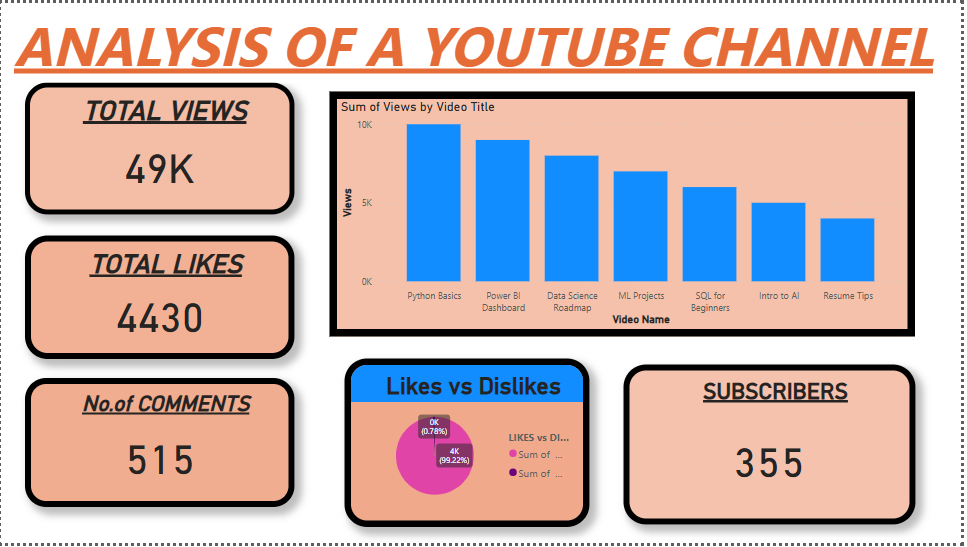

# 📊 YouTube Channel Analytics Dashboard

This Power BI project provides a detailed performance analysis of a YouTube channel using data like views, likes, watch time, and subscriber gain.

## 🚀 Features

- Total Views, Watch Time, Subscribers (KPI Cards)
- Top 10 Performing Videos
- Trend of Views Over Time
- Engagement Analysis (Likes, Comments, Watch Time)
- Interactive Filters for Date & Video Titles

### 🔹 Dashboard Overview  
  
*Visualizing channel performance using clear and intuitive charts.*

## 🧰 Tools Used

- Power BI
- DAX (for custom metrics)
- Power Query (for data cleaning)
- CSV (for data source)

## 📁 Dataset

Sample dataset is available in `dataset/youtube_data.csv`

## 📎 How to Use
1. Clone the repository
2. Open `.pbix` file using **Power BI Desktop**
3. Refresh data (if connected) or explore the existing visuals

## 🙋‍♂️ About the Creator
**Tarun Chaudhary**  
📍 Data Science Student at IIT Madras  
🔗 [LinkedIn](https://www.linkedin.com/in/tarun-chaudhary-5812bb326)

## ⭐ If you like this project...
Give it a ⭐ on GitHub and connect with me!

