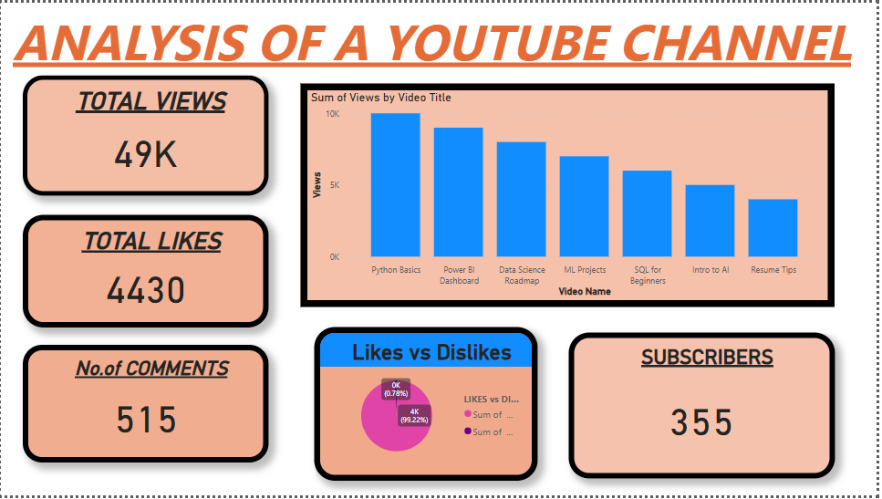

# 📊 YouTube Channel Analytics Dashboard | Power BI

## 📁 Dataset Summary
The dataset contains basic metrics for each video:
- 🎬 **Video Title**
- 📅 **Upload Date**
- 👁️ **Views**
- 👍 **Likes**
- 💬 **Comments**
- 📈 **Dislikes**
- 👥 **Subscribers**

> *(Dataset is based on either self-recorded channel data or synthetic data for visualization purposes)*

## 📊 Dashboard Highlights

### 📌 KPI Cards:
- **Total Views**: 49K  
- **Total Likes**: 4430  
- **Comments**: 515  
- **Subscribers**: 355  

### 📈 Visualizations:
- **Bar Chart** – Views per Video Title (Top videos: *Python Basics*, *Power BI*, *Data Science Roadmap*)
- **Pie Chart** – Likes vs Dislikes Ratio
- **Clean layout** with highlighted KPIs and a professional color palette

## 📷 Screenshots

### 🔹 Dashboard Overview  
  
*Visualizing channel performance using clear and intuitive charts.*

## 🛠️ Tools & Skills Used
- **Power BI Desktop**
- **Power Query Editor** for data cleaning
- **DAX** for calculated fields and KPIs
- **Data Storytelling** and dashboard design

## 🧠 What I Learned
- Building dynamic visuals using Power BI
- Cleaning and transforming data using Power Query
- Designing insightful dashboards for real-world content platforms
- Presenting metrics in an intuitive and professional layout

